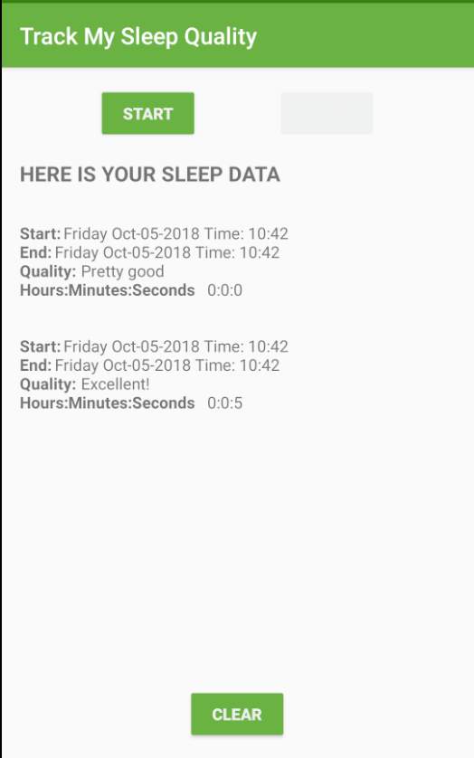
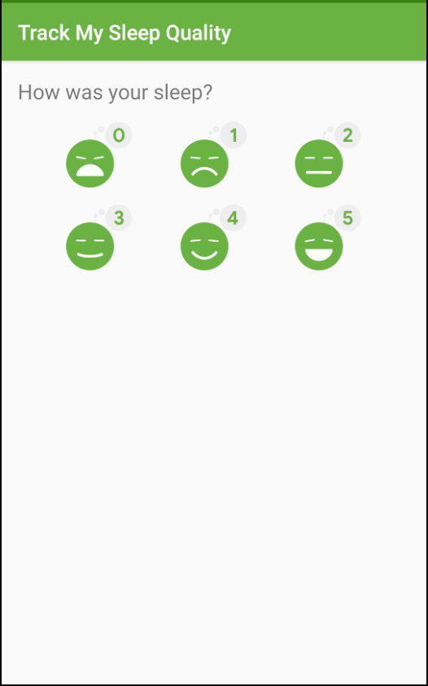

# Room - SleepQualityTracker app

This is a app as part of the [Android App Development in Kotlin course on Udacity](https://www.udacity.com/course/???).

## SleepQualityTracker

The SleepQualityTracker app is a demo app that helps you collect information about your sleep. 
* Start time
* End time
* Quality
* Time slept

This app demonstrates the following views and techniques:
* Room database
* DAO
* Coroutines

It also uses and builds on the following techniques from previous lessons:
* Transformation map
* Data Binding in XML files
* ViewModel Factory
* Using Backing Properties to protect MutableLiveData
* Observable state LiveData variables to trigger navigation

## Screenshots

## How to use this repo while taking the course

Each code repository in this class has a chain of commits that looks like this:

These commits show every step you'll take to create the app. Each commit contains instructions for completing the that step.

Each commit also has a **branch** associated with it of the same name as the commit message, as seen below:

Access all branches from this tab.

